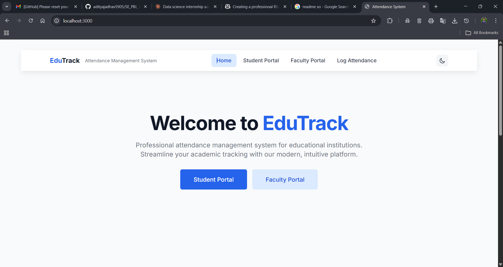
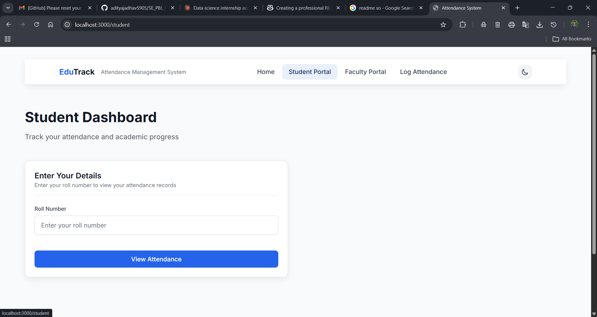
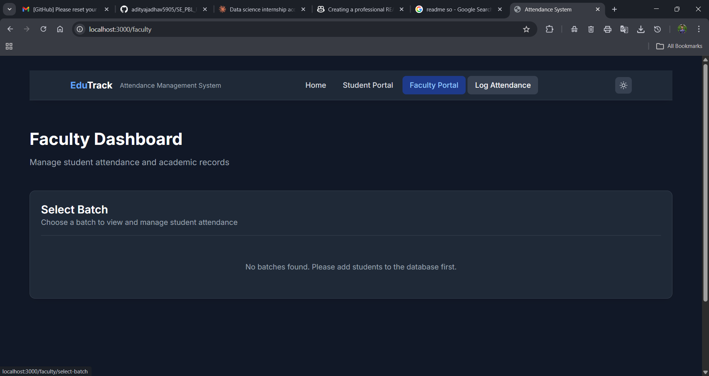

## EduTrack – Attendance Management System

EduTrack is a full‑stack **attendance management system** for educational institutions. It provides a modern, responsive web interface where **students** can view their attendance analytics and **faculty** can manage batches and log attendance in real time.

### Screenshots








### Key Features

- **Landing page**: Clean home screen introducing EduTrack with quick access to student and faculty portals.
- **Student portal**:
  - View attendance by **roll number**.
  - See overall attendance as well as **subject‑wise breakdown**.
  - Visual representation of attendance trends (powered by Recharts).
- **Faculty portal**:
  - View **all batches** and students in each batch.
  - Quickly **log / update attendance** for individual subjects.
  - Auto‑recalculation of **subject‑wise** and **overall attendance percentages**.
- **Log attendance view**: Simple UI to mark present/absent and push updates to the backend.
- **Dark/light mode**: Theme toggle for a better user experience.
- **Real database**:
  - MySQL schema with realistic attendance records generated from CSV data.
  - Python script to generate `INSERT` queries with accurate per‑subject and overall percentages.

---

## Tech Stack

- **Frontend**
  - React 18 (Vite)
  - React Router DOM
  - Tailwind CSS
  - Recharts
  - Axios

- **Backend**
  - Spring Boot 3 (Spring Web, Spring Data JPA)
  - Java 17
  - Maven

- **Database & Data**
  - MySQL 8+
  - `data for database/db.csv` – base CSV with student and attendance averages
  - `data for database/db.py` – Python + pandas script to generate SQL inserts
  - `data for database/insert.sql` – generated `INSERT` statements for `student_attendance_summary`

---

## Project Structure

```text
attendance-web/
├─ attendance-web/                      # Spring Boot backend
│  ├─ src/main/java/com/example/attendance/
│  │  ├─ model/                         # JPA entities (e.g., StudentAttendanceSummary)
│  │  ├─ repository/                    # Spring Data repositories
│  │  └─ controller/
│  │     └─ StudentAttendanceSummaryController.java
│  ├─ src/main/resources/
│  │  └─ application.properties         # Database configuration
│  └─ pom.xml                           # Maven configuration
│
├─ attendance-frontend/frontend/        # React + Vite frontend
│  ├─ src/
│  │  ├─ pages/                         # UI pages (Home, Student, Faculty, Log Attendance)
│  │  ├─ components/                    # Reusable UI components
│  │  ├─ contexts/                      # Theme context (light/dark)
│  │  ├─ services/
│  │  │  └─ attendanceService.js        # Axios calls to backend API
│  │  └─ config/
│  │     └─ api.js                      # Backend base URL configuration
│  ├─ index.html
│  ├─ package.json
│  └─ vite.config.js
│
├─ data for database/
│  ├─ db.csv                            # Input CSV (roll no, name, batch, Avg)
│  ├─ db.py                             # Generates SQL queries from CSV
│  └─ insert.sql                        # Output INSERT statements for MySQL
│
└─ README.md                            # This file
```

---

## Backend – Spring Boot API

The backend exposes REST endpoints for fetching and updating student attendance summaries.

Base path: **`/api/student-attendance`**

- **Get student by roll number**
  - **Method**: `GET`
  - **URL**: `/api/student-attendance/roll/{rollNo}`
  - **Description**: Returns a single `StudentAttendanceSummary` for the given roll number.

- **Get all students of a batch**
  - **Method**: `GET`
  - **URL**: `/api/student-attendance/batch/{batch}`
  - **Description**: Returns a list of students belonging to the provided batch ID/code.

- **Get all unique batches**
  - **Method**: `GET`
  - **URL**: `/api/student-attendance/batches`
  - **Description**: Returns all distinct batch values available in the database.

- **Update attendance for a subject**
  - **Method**: `PUT`
  - **URL**: `/api/student-attendance/update/{id}`
  - **Query params**:
    - `subject` – one of `dbm`, `mc`, `eft`, `dc`, `cn`
    - `present` – `true` if the student was present, `false` if absent
  - **Description**:
    - Increments either the `present` or `absent` count for that subject.
    - Recomputes the **subject percentage** and the **overall total percentage**.

### Backend configuration

The datasource is configured in `attendance-web/src/main/resources/application.properties`:

- **Database URL**: `jdbc:mysql://localhost:3306/studentdb`
- **Username**: `root` (change as needed)
- **Password**: `<your-password>` (replace with your local MySQL password)
- **JPA**: `spring.jpa.hibernate.ddl-auto=update` (schema will be created/updated automatically)

---

## Frontend – React App

The React app is created using Vite and Tailwind CSS and communicates with the Spring Boot API via Axios.

- **Base API URL**: configured in `attendance-frontend/frontend/src/config/api.js`.
  - By default it uses `http://localhost:8080` as the backend URL.
  - You can also expose a `VITE_BACKEND_URL` environment variable and wire it into the config if you want to make this configurable.

### Main UI flows

- **Home page**:
  - Shows project title, tagline, and buttons to open **Student Portal** and **Faculty Portal**.
- **Student Dashboard**:
  - Input field for **Roll Number**.
  - Fetches data via `GET /api/student-attendance/roll/{rollNo}`.
  - Displays subject‑wise attendance and charts (e.g., bar or pie charts) using Recharts.
- **Faculty Dashboard**:
  - Loads all batches from `GET /api/student-attendance/batches`.
  - On selecting a batch, fetches students via `GET /api/student-attendance/batch/{batch}`.
  - Provides actions to **log attendance** by calling `PUT /api/student-attendance/update/{id}`.
- **Theme toggle**:
  - Implemented via a React context in `src/contexts/ThemeContext.jsx`.
  - Allows switching between light and dark themes across the app.

---

## Data Generation & Database Setup

### 1. Prepare MySQL database

- **Create database**:

```sql
CREATE DATABASE studentdb;
USE studentdb;
```

- Ensure your MySQL server is running and the credentials in `application.properties` match your local setup.

### 2. Generate INSERT queries (optional, if you want to regenerate data)

Inside the `data for database/` folder:

- **Prerequisites**:
  - Python 3
  - `pandas` (`pip install pandas`)

- **Steps**:

```bash
cd "data for database"
python db.py
```

This reads `db.csv`, generates realistic subject‑wise attendance values that match the overall average, and writes SQL `INSERT` statements to `insert.sql`.

### 3. Load sample data into MySQL

In MySQL, after selecting the `studentdb` database:

```sql
SOURCE path/to/insert.sql;
```

This will populate the `student_attendance_summary` table with sample data for testing the application.

---

## Running the Project Locally

### 1. Prerequisites

- **Java 17+**
- **Node.js 18+** and **npm** or **yarn**
- **MySQL 8+**
- **Python 3 + pandas** (only if you want to regenerate SQL from CSV)

### 2. Start the backend (Spring Boot)

```bash
cd attendance-web/attendance-web
mvn spring-boot:run
```

The backend will start on `http://localhost:8080` by default.

### 3. Start the frontend (React + Vite)

```bash
cd attendance-frontend/frontend
npm install
npm run dev
```

By default, Vite serves the app on `http://localhost:5173` (or `http://localhost:3000` if configured accordingly).

Make sure the backend URL in `src/config/api.js` (and/or your `.env` file) matches the actual backend port.

---

## How It All Works Together

- The **frontend** calls the **Spring Boot REST API** using Axios functions defined in `attendanceService.js`.
- The **controller** (`StudentAttendanceSummaryController`) queries and updates data through `StudentAttendanceSummaryRepository`.
- **MySQL** stores detailed present/absent counts and percentages for each subject, as well as overall totals.
- When faculty update attendance for a subject, the backend automatically recalculates:
  - Subject present/absent counts and percentage.
  - Overall total present, total absent, and total percentage.

---

## Possible Improvements / Future Work

- **Authentication & roles**: Add login with role‑based access (Admin / Faculty / Student).
- **More analytics**: Weekly/monthly trends, alerts for low attendance, export to CSV/PDF.
- **Responsive enhancements**: Further optimize for small mobile screens.
- **Dockerization**: Containerize backend, frontend, and database for easier deployment.
- **CI/CD**: Add automated tests and GitHub Actions / CI pipeline to build and verify the project on every push.

---

## License

This project was created as an academic / PBL project. You can adapt or extend it for learning and non‑commercial purposes; add a formal license here if you plan to share or publish it.

